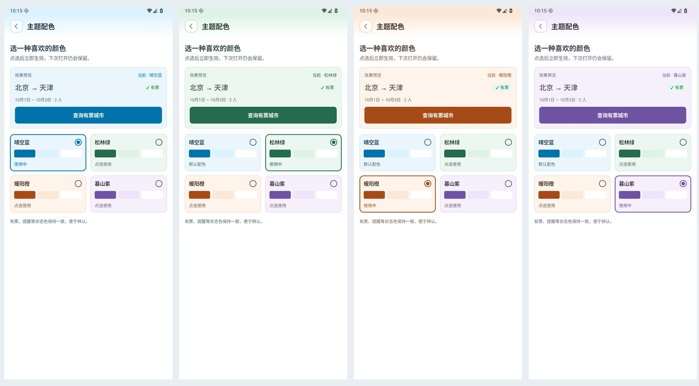
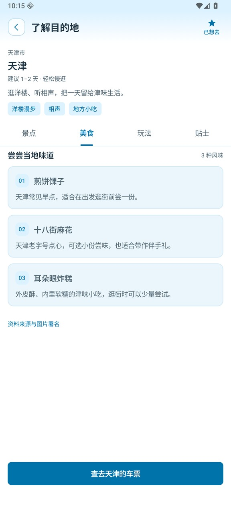
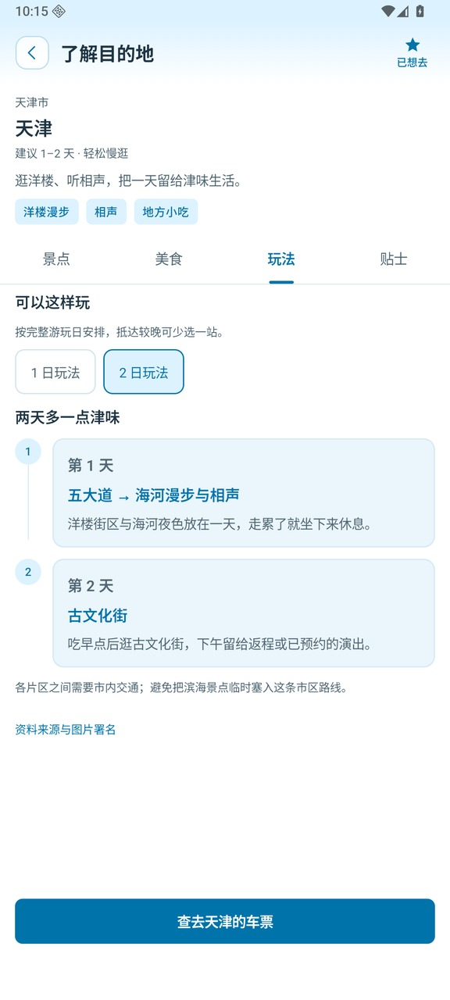
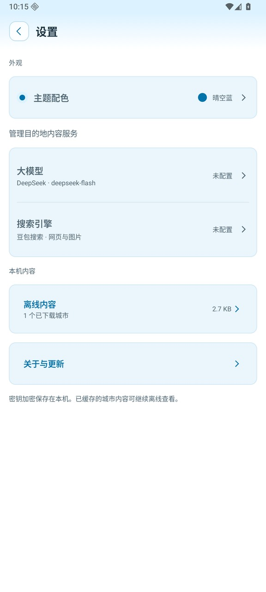
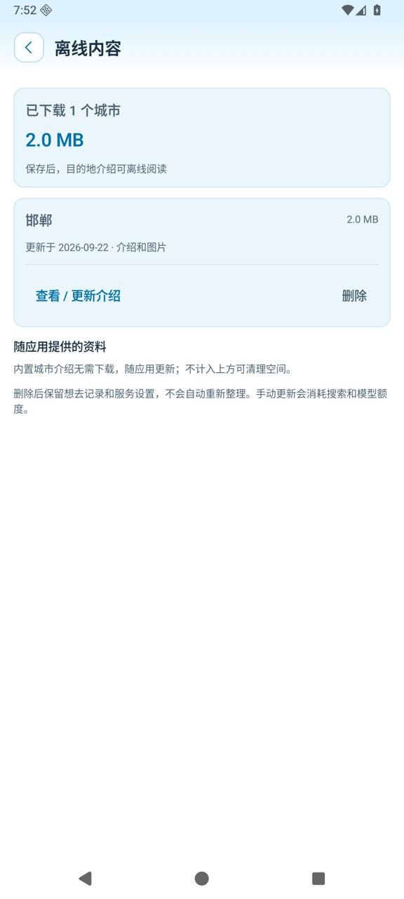

# 有票再出发 · Train Trip

**先看哪里有票，再决定去哪里。**

> [!TIP]
> **假期快到了，又没抢到票，旅行就要泡汤了吗？**
>
> 你是否也有过这样的经历：满心期待假期旅行，打开 12306 抢票，结果还是没抢到。一次又一次，真的很烦。
>
> **“有没有还有票的城市？把它们列出来，我从里面选！”**
>
> **有票再出发，就是帮你做这件事的。** 圈定一批想考虑的城市，设好能接受的乘车时长和出发日期范围，应用会查询直达去程车票，**只展示查询时有票、且符合你筛选条件的城市**。再结合城市的简单介绍，看看有什么好玩、好吃的，帮你更快决定下一站。
>
> **少一点“没票就算了”的遗憾，多一次发现小众冷门城市的旅行。先看有票，再选目的地～**

**[⬇ 下载 Android 正式版 v1.0.0](https://github.com/chengweiv5/train-trip/releases/download/v1.0.0/train-trip-v1.0.0-release.apk)**　·　[更新说明与历史版本](https://github.com/chengweiv5/train-trip/releases)　·　[安装方法](#下载安装)

Android 8.0 及以上 · 无需注册应用账号 · 查票无需配置 API Key

> 当前正式版为 **v1.0.0**：晴空蓝、松林绿、暖阳橙、暮山紫四套主题随心切换；目的地支持独立的多日玩法，每城市最多保留三种天数。[查看更新说明](docs/releases/v1.0.0.md)

## 给一次临时起意的旅行，找个目的地

- **不用逐城试车票**：一次选择多个目的地，按符合条件的直达去程余票发现可去城市。
- **按自己的时间出发**：日期范围、出发时段多选、席别、人数、3 小时 / 5 小时或自定义车程，都能调整。
- **先了解，再决定**：在景点、美食、玩法、贴士之间切换，看看这座城市适合怎样玩。
- **把心动留到下次**：批量收藏城市，按省份查看或通过「全部」浏览；最近收藏排在前面，查票时可直接从「想去」分组选取。
- **准备好，再去购票**：对比发到时刻、车程和席别余票，打开 12306 App 完成后续查询与购票。
- **换一种喜欢的颜色**：晴空蓝、松林绿、暖阳橙、暮山紫四套浅色主题，点选即切换，下次打开仍会保留。

## v1.0：选一种喜欢的配色

进入 **设置 → 外观 → 主题配色**，先看效果预览，再点选喜欢的主题。晴空蓝延续原有外观；松林绿、暖阳橙、暮山紫会同步调整页头、按钮、卡片与选中状态。

选择自动保存在本机，离线也能切换。切换时保留筛选条件、车次标记和想去清单；有票、提醒等状态色保持一致，便于辨认。小屏或大字号下，主题选项会改为可滚动的单列。

[](docs/images/v1.0-themes/picker-comparison.jpg)

[查看四套主题的首页效果](docs/images/v1.0-themes/home-comparison.jpg) · [可编辑设计稿](design/train-trip-v1.0.0-themes.pen)

以上为 v1.0 主题功能在专用 Android 模拟器中的实际界面。预览中的城市、日期与余票为演示数据；功能与验证范围见[主题验收记录](docs/verification/2026-09-23-v1.0-themes.md)。

## 界面一览

下面 10 张截图来自 Android 模拟器中的 v0.9.0 界面，按「设条件 → 选城市 → 看车次 → 了解目的地 → 管理内容」展示主要功能。点击图片可查看大图。

车次、余票、日期和收藏使用离线演示数据；邯郸图文和玩法是把电脑端豆包搜索、DeepSeek 整理的成功样本导入模拟器后展示的。它们不是个人手机截图，也不能证明手机端已成功生成相同内容。截图用于说明界面，不代表实时余票或每个城市都能找到完整图片、路线。[截图来源与采集说明](docs/images/readme/README.md)

<table>
  <tr>
    <td width="50%" align="center" valign="top">
      <strong>① 设好条件，发现有票城市</strong><br><br>
      <a href="docs/images/readme/home.jpg"></a><br>
      选择出发地、日期范围和可接受的车程；出发时段可多选，一次查询多个目的地。
    </td>
    <td width="50%" align="center" valign="top">
      <strong>② 比一比，哪些城市适合出发</strong><br><br>
      <a href="docs/images/readme/results.jpg"></a><br>
      结果按省份分组，结合车次数、最快车程和城市亮点比较；可查看介绍或进入车次列表。
    </td>
  </tr>
  <tr>
    <td width="50%" align="center" valign="top">
      <strong>③ 看清车次，再去 12306</strong><br><br>
      <a href="docs/images/readme/trains.jpg"></a><br>
      对比发到时刻、车程和余票，可标记意向车次、手动刷新；打开 12306 App 核验并购票。
    </td>
    <td width="50%" align="center" valign="top">
      <strong>④ 从「想去」快速选择目的地</strong><br><br>
      <a href="docs/images/readme/destinations.jpg"></a><br>
      按省份查找城市，也可直接勾选「想去」清单；当前选择会带回查票条件。
    </td>
  </tr>
  <tr>
    <td width="50%" align="center" valign="top">
      <strong>⑤ 收藏心动城市，下次再出发</strong><br><br>
      <a href="docs/images/readme/wishlist.jpg"></a><br>
      通过「全部」浏览所有收藏，或按省份筛选；最近收藏优先，可直接了解目的地或查车票。
    </td>
    <td width="50%" align="center" valign="top">
      <strong>⑥ 看景点介绍，也看实景图片</strong><br><br>
      <a href="docs/images/readme/guide.jpg"></a><br>
      每个景点有独立介绍与相册，可横滑、查看大图和来源；景点累计最多 10 个，每项最多 3 张图。
    </td>
  </tr>
  <tr>
    <td width="50%" align="center" valign="top">
      <strong>⑦ 看看当地有什么好吃的</strong><br><br>
      <a href="docs/images/readme/food.jpg"></a><br>
      美食按具体菜品介绍，找到匹配照片时展示参考图；累计最多 10 种，没有合适图片时保留文字。
    </td>
    <td width="50%" align="center" valign="top">
      <strong>⑧ 参考一日、两日玩法</strong><br><br>
      <a href="docs/images/readme/plans.jpg"></a><br>
      此图为导入成功样本后的模拟器演示。可查看按天安排的景点顺序和攻略原文；实际整理可能没有可用路线。
    </td>
  </tr>
  <tr>
    <td width="50%" align="center" valign="top">
      <strong>⑨ 按需配置内容服务</strong><br><br>
      <a href="docs/images/readme/settings.jpg"></a><br>
      DeepSeek 整理介绍，豆包检索网页和图片；填入自己的 Key 后手动整理，查票与收藏无需配置。
    </td>
    <td width="50%" align="center" valign="top">
      <strong>⑩ 保存到本机，随时再看</strong><br><br>
      <a href="docs/images/readme/offline.jpg"></a><br>
      查看已保存城市和占用空间，按需更新或删除；清理离线资料会保留收藏与服务设置。
    </td>
  </tr>
</table>

景点与美食图片均保留来源，图片权利归原作者及相关权利人所有。美食照片为菜品参考图；[查看图文出处](docs/images/readme/README.md#图文来源)。

## 三步开始一次短途旅行

1. **告诉它你什么时候能走。** 选择出发城市、日期、时段和最长车程；想少坐一会儿车，就先试试「3 小时」。
2. **挑一座有票又心动的城市。** 点击「查询有票城市」，查看结果、了解目的地，也可以先收藏。
3. **到 12306 App 核验并购票。** 查看合适车次后，点击「打开 12306 App」，手动填写条件完成购票。返程车票需要另行安排。

## 下载安装

| 下载入口 | 说明 |
| --- | --- |
| **[下载 v1.0.0 正式 APK](https://github.com/chengweiv5/train-trip/releases/download/v1.0.0/train-trip-v1.0.0-release.apk)** | 生产签名 Release 包 |
| [查看最新正式发布](https://github.com/chengweiv5/train-trip/releases/latest) | 更新说明与安装附件 |
| [下载 SHA-256 校验文件](https://github.com/chengweiv5/train-trip/releases/download/v1.0.0/train-trip-v1.0.0-release.apk.sha256) | 用于核对安装包完整性 |

在 Android 手机上下载 APK 后打开，按系统提示允许当前浏览器或文件管理器安装应用，再完成安装。打开应用即可查票，不必先配置大模型或搜索服务。

同一生产签名的正式版可以直接覆盖升级。若系统提示签名冲突，通常是曾安装开发测试包；请先确认版本来源，卸载会清除本机收藏、设置和离线介绍。应用内也可通过「设置 → 关于与更新」手动检查新版本。

## 常见问题

### 能直接买票或抢票吗？

应用负责发现目的地与查询余票，不提供购票、抢票或自动下单。「打开 12306 App」会唤起已安装的铁路 12306，仍需在其中手动填写条件。余票随时变化，最终以 12306 App 的查询及下单结果为准。本项目是个人开发的独立工具，与铁路 12306 无隶属关系。

### 不配置 DeepSeek、豆包搜索也能用吗？

可以。**查票、想去清单和内置城市介绍都不需要 Key。** 天津、济南、青岛、大同、洛阳已有内置资料，可离线阅读。

想为其他城市整理介绍时，再到「设置」填写自己的 DeepSeek 与豆包搜索 Custom 版 API Key。只有手动发起整理或更新，才会调用这些服务并消耗相应额度；打开新城市不会自动生成。资料优先采用国内简体中文来源，保存后可离线查看，也可在「离线内容」中管理。分发的 APK 不包含个人 Key，无需自建服务器。网页搜索和缺图条目的图片搜索使用豆包，DeepSeek 负责整理；每城市最多保留 10 个景点和 10 种美食。升级后需单独填写豆包搜索 Key，旧 Tavily Key 不会自动迁移。

v1.0 的玩法规则：支持 1 天、2 天及 N 天参考安排，每种天数保留一条，单次及累计最多 3 种，按天数从短到长优先保留。不同玩法可以参考不同文章，同一条多日玩法来自同一篇攻略。玩法地点独立于景点列表，不受景点累计 10 项限制；无需逐字摘录或与景点、顺序作一致性校验。仍保留来源链接和按天完整的日程，实际可用天数取决于检索资料。

### 可以查任意城市、所有车站吗？

可以更换出发城市，并在已收录的目的地目录中选择查询范围；默认勾选 24 个城市。目前查询**直达去程**，不规划中转或往返组合。车站映射和代表站策略可能遗漏部分同城站及路线，不保证全国完整覆盖。查询失败会给出提示，未查到结果也不等同于所有路线都无票。

### 需要哪些权限？数据放在哪里？

应用仅申请网络权限，不读取定位、通讯录。筛选偏好、想去清单、服务配置与已下载介绍保存在本机；v1.0 的主题选择也仅保存在本机，没有应用账号或云同步。查票需要联网；手动生成介绍会把城市检索与资料整理请求发送给你配置的搜索和模型服务。卸载应用会删除本机数据。

## 参与与开发

遇到问题或有想法，欢迎[提交 Issue](https://github.com/chengweiv5/train-trip/issues)。反馈时附上应用版本、手机系统和复现步骤；如果它帮你找到了下一站，也欢迎点个 Star。

<details>
<summary>本地构建与项目资料</summary>

技术栈为 Kotlin + Jetpack Compose。构建环境：JDK 21、Android SDK 36；在本机 `local.properties` 中配置 `sdk.dir`。

```bash
./gradlew :core:test :app:assembleDebug :app:lintRelease :app:assembleRelease
```

Release 默认生成未签名包，分发前需使用仓库外的私有签名配置。不要提交签名私钥或服务 Key。

连接专用测试设备后可运行 `./gradlew :app:connectedDebugAndroidTest`。该完整测试集包含少量真实 12306 查询，不应高频循环；核心测试离线运行。

- [开发历史与验收索引](docs/development-history.md)
- [已确认的 UI 设计](design/README.md)
- [v1.0 主题设计与切换验收](docs/verification/2026-09-23-v1.0-themes.md)
- [v1.0.0 更新说明](docs/releases/v1.0.0.md)
- [v1.0.0 发布验证](docs/verification/2026-09-23-v1.0.0-release.md)
- [v0.9.0 更新说明](docs/releases/v0.9.0.md)
- [v0.9.0 发布验证](docs/verification/2026-09-23-v0.9.0-release.md)
- [v0.6.1 开发实现与验证](docs/verification/2026-09-21-v0.6.1.md)
- [v0.5.0 / v0.6.0 正式发布记录](docs/verification/2026-09-21-v0.5.0-v0.6.0-releases.md)

</details>
