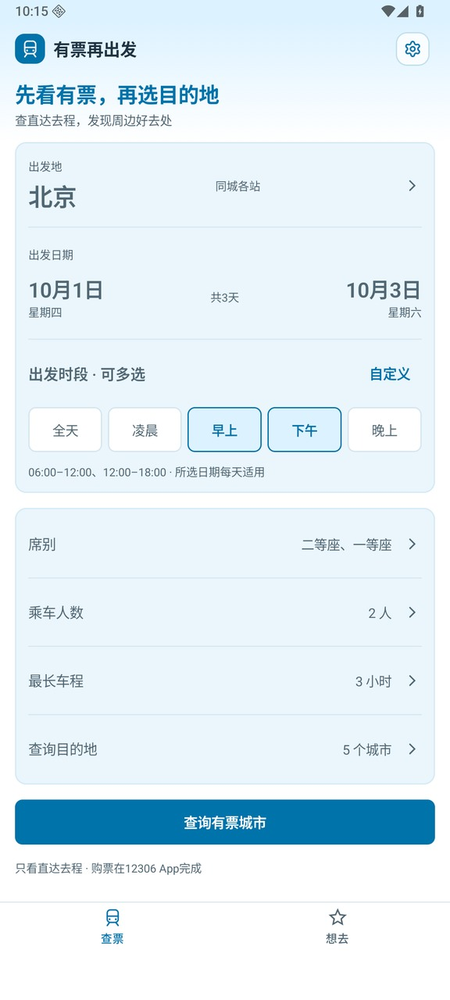
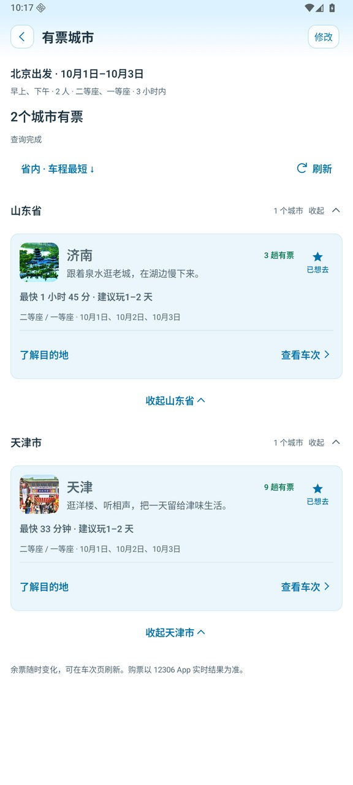
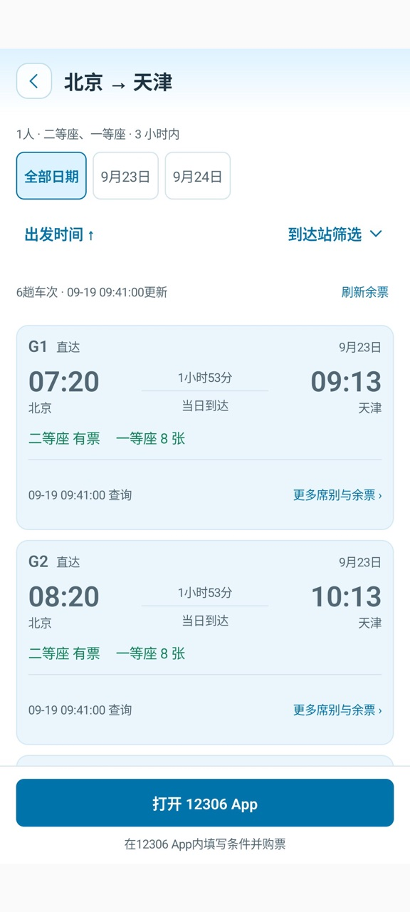
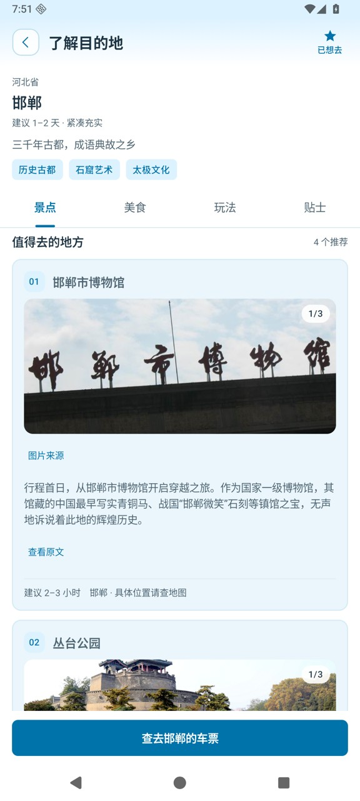
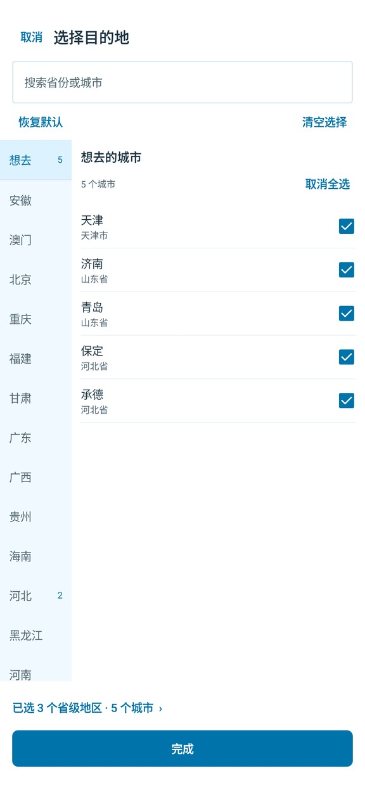

# 有票再出发 · Train Trip

**先看哪里有票，再决定去哪里。**

> [!TIP]
> **假期快到了，又没抢到票，旅行就要泡汤了吗？**
>
> 你是否也有过这样的经历：满心期待假期旅行，打开 12306 抢票，结果还是没抢到。一次又一次，真的很烦。
>
> **“有没有还有票的城市？把它们列出来，我从里面选！”**
>
> **有票再出发，就是帮你做这件事的。** 圈定一批想考虑的城市，设好能接受的乘车时长和出发日期范围，应用会查询直达去程车票，**只展示查询时有票、且符合你筛选条件的城市**。再结合城市的简单介绍，看看有什么好玩、好吃的，帮你更快决定下一站。
>
> **少一点“没票就算了”的遗憾，多一次发现小众冷门城市的旅行。先看有票，再选目的地～**

**[⬇ 下载 Android 正式版 v0.8.0](https://github.com/chengweiv5/train-trip/releases/download/v0.8.0/train-trip-v0.8.0-release.apk)**　·　[更新说明与历史版本](https://github.com/chengweiv5/train-trip/releases)　·　[安装方法](#下载安装)

Android 8.0 及以上 · 无需注册应用账号 · 查票无需配置 API Key

> 当前正式版为 **v0.8.0**，应用名称已统一为「有票再出发」。景点与美食各有独立相册，每条目最多 3 张、每城市最多 100 张；全量更新保留旧条目，只为零图条目补图。

## 给一次临时起意的旅行，找个目的地

- **不用逐城试车票**：一次选择多个目的地，按符合条件的直达去程余票发现可去城市。
- **按自己的时间出发**：日期范围、出发时段多选、席别、人数、3 小时 / 5 小时或自定义车程，都能调整。
- **先了解，再决定**：在景点、美食、玩法、贴士之间切换，看看这座城市适合怎样玩。
- **把心动留到下次**：批量收藏城市，按省份查看或通过「全部」浏览；最近收藏排在前面，查票时可直接从「想去」分组选取。
- **准备好，再去购票**：对比发到时刻、车程和席别余票，打开 12306 App 完成后续查询与购票。

## 界面一览

以下为 v0.7.0 及此前开发过程中采集的实际界面截图；v0.8.0 已将图片改为对应条目的独立相册，以下目的地截图保留旧版样式。日期、车次、余票与收藏使用离线演示数据，不代表实时可购车票；想去页截图为加入「全部」入口前的省份视图。点击图片可查看大图。

<table>
  <tr>
    <td width="50%" align="center" valign="top">
      <strong>① 设好条件，发现有票城市</strong><br><br>
      <a href="docs/images/readme/home.jpg"></a><br>
      时间、距离和出行人数，都按你的计划来。
    </td>
    <td width="50%" align="center" valign="top">
      <strong>② 看看哪些城市值得出发</strong><br><br>
      <a href="docs/images/readme/results.jpg"></a><br>
      车程、车次数与城市亮点放在一起比较。
    </td>
  </tr>
  <tr>
    <td width="50%" align="center" valign="top">
      <strong>③ 选个合适的车次</strong><br><br>
      <a href="docs/images/readme/trains.jpg"></a><br>
      看清发到时间和余票，再前往 12306 App。
    </td>
    <td width="50%" align="center" valign="top">
      <strong>④ 车票之外，也有旅行灵感</strong><br><br>
      <a href="docs/images/readme/guide.jpg"></a><br>
      看景点与当地风味，为一两天的旅行找灵感。
    </td>
  </tr>
  <tr>
    <td width="50%" align="center" valign="top">
      <strong>⑤ 收藏想去的地方</strong><br><br>
      <a href="docs/images/readme/wishlist.jpg"></a><br>
      清单保存在本机，有空时再出发。
    </td>
    <td width="50%" align="center" valign="top">
      <strong>⑥ 下次查票，直接选「想去」</strong><br><br>
      <a href="docs/images/readme/destinations.jpg"></a><br>
      收藏与查票衔接，不必在省市列表里重新找。
    </td>
  </tr>
</table>

截图中的天津古文化街照片：胡凌云／天津日报，刊载于[天津市文化和旅游局](https://whly.tj.gov.cn/tjswlzxw/wlsj/mtjj/202404/t20240419_6605163.html)。[截图来源与版本说明](docs/images/readme/README.md)

## 三步开始一次短途旅行

1. **告诉它你什么时候能走。** 选择出发城市、日期、时段和最长车程；想少坐一会儿车，就先试试「3 小时」。
2. **挑一座有票又心动的城市。** 点击「查询有票城市」，查看结果、了解目的地，也可以先收藏。
3. **到 12306 App 核验并购票。** 查看合适车次后，点击「打开 12306 App」，手动填写条件完成购票。返程车票需要另行安排。

## 下载安装

| 下载入口 | 说明 |
| --- | --- |
| **[下载 v0.8.0 正式 APK](https://github.com/chengweiv5/train-trip/releases/download/v0.8.0/train-trip-v0.8.0-release.apk)** | 生产签名 Release 包 |
| [查看最新正式发布](https://github.com/chengweiv5/train-trip/releases/latest) | 更新说明与安装附件 |
| [下载 SHA-256 校验文件](https://github.com/chengweiv5/train-trip/releases/download/v0.8.0/train-trip-v0.8.0-release.apk.sha256) | 用于核对安装包完整性 |

在 Android 手机上下载 APK 后打开，按系统提示允许当前浏览器或文件管理器安装应用，再完成安装。打开应用即可查票，不必先配置大模型或搜索服务。

同一生产签名的正式版可以直接覆盖升级。若系统提示签名冲突，通常是曾安装开发测试包；请先确认版本来源，卸载会清除本机收藏、设置和离线介绍。应用内也可通过「设置 → 关于与更新」手动检查新版本。

## 常见问题

### 能直接买票或抢票吗？

应用负责发现目的地与查询余票，不提供购票、抢票或自动下单。「打开 12306 App」会唤起已安装的铁路 12306，仍需在其中手动填写条件。余票随时变化，最终以 12306 App 的查询及下单结果为准。本项目是个人开发的独立工具，与铁路 12306 无隶属关系。

### 不配置 DeepSeek、Tavily 也能用吗？

可以。**查票、想去清单和内置城市介绍都不需要 Key。** 天津、济南、青岛、大同、洛阳已有内置资料，可离线阅读。

想为其他城市整理介绍时，再到「设置」填写自己的 DeepSeek 与 Tavily API Key。只有手动发起整理或更新，才会调用这些服务并消耗相应额度；打开新城市不会自动生成。资料优先采用国内简体中文来源，保存后可离线查看，也可在「离线内容」中管理。分发的 APK 不包含个人 Key，无需自建服务器。

### 可以查任意城市、所有车站吗？

可以更换出发城市，并在已收录的目的地目录中选择查询范围；默认勾选 24 个城市。目前查询**直达去程**，不规划中转或往返组合。车站映射和代表站策略可能遗漏部分同城站及路线，不保证全国完整覆盖。查询失败会给出提示，未查到结果也不等同于所有路线都无票。

### 需要哪些权限？数据放在哪里？

应用仅申请网络权限，不读取定位、通讯录。筛选偏好、想去清单、服务配置与已下载介绍保存在本机，没有应用账号或云同步。查票需要联网；手动生成介绍会把城市检索与资料整理请求发送给你配置的搜索和模型服务。卸载应用会删除本机数据。

## 参与与开发

遇到问题或有想法，欢迎[提交 Issue](https://github.com/chengweiv5/train-trip/issues)。反馈时附上应用版本、手机系统和复现步骤；如果它帮你找到了下一站，也欢迎点个 Star。

<details>
<summary>本地构建与项目资料</summary>

技术栈为 Kotlin + Jetpack Compose。构建环境：JDK 21、Android SDK 36；在本机 `local.properties` 中配置 `sdk.dir`。

```bash
./gradlew :core:test :app:assembleDebug :app:lintRelease :app:assembleRelease
```

Release 默认生成未签名包，分发前需使用仓库外的私有签名配置。不要提交签名私钥或服务 Key。

连接专用测试设备后可运行 `./gradlew :app:connectedDebugAndroidTest`。该完整测试集包含少量真实 12306 查询，不应高频循环；核心测试离线运行。

- [开发历史与验收索引](docs/development-history.md)
- [已确认的 UI 设计](design/README.md)
- [v0.8.0 更新说明](docs/releases/v0.8.0.md)
- [v0.8.0 发布验证](docs/verification/2026-09-22-v0.8.0-release.md)
- [v0.6.1 开发实现与验证](docs/verification/2026-09-21-v0.6.1.md)
- [v0.5.0 / v0.6.0 正式发布记录](docs/verification/2026-09-21-v0.5.0-v0.6.0-releases.md)

</details>
